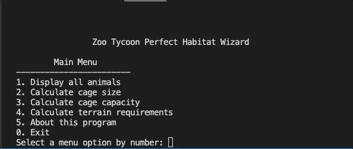
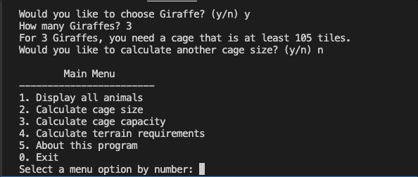
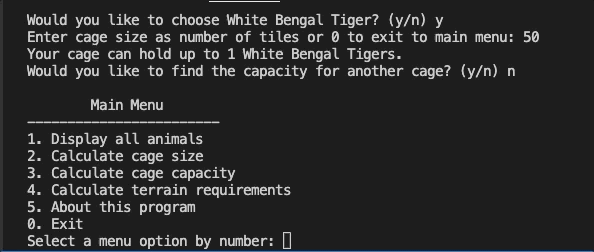

# Zoo Tycoon Perfect Habitat Wizard
  A tool to help you create the perfect habitat for your zoo animals in the 2001 PC game Zoo Tycoon.
  Designed to be used with the strategy guide written by Steven W. Carter: https://gamefaqs.gamespot.com/pc/472139-zoo-tycoon-2001/faqs/19545
  
  *Functionality*

  1. View full list of animals currently supported in the program
  
  
  2. Enter an animal and quantity to calculate the minimum cage size you will need
  

  3. Enter an animal and the size of your current cage to find out how many of that animal will fit
  

  4. Enter an animal and cage size to calculate the terrain requirements
  

   *Future updates*
   1. Add animals from Dinosaur Digs and Marine Mania expansions
   2. Add foliage and rock details to terrain requirements
   3. Terrain calculation update to avoid leftover tiles
   4. Utilize minimum and maximum data for each animal in cage capacity requirements. EX: the minimum cage size for herd animals will be based on the recommended minimum herd size. 
